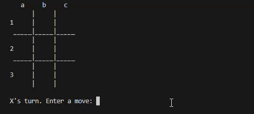

# Tic Tac Toe AI 🤖
> The minimax algorithm makes the most optimal move in any turn-based zero-sum game like tic tac toe

 
  

<!-- TABLE OF CONTENTS -->

  
 :book: Table of Contents

  <ul>
    <li><a href="#motivation"> Motivation</a></li>
    <li><a href="#overview"> Overview</a></li>
    <li><a href="#getting-started-guide"> Getting Started Guide</a>
    </li>
    <li><a href="#minimax-algorithm"> Minimax Algorithm</a>
      <ul>
        <li><a href="#alpha-beta-pruning"> Alpha-beta Pruning</a></li>
      </ul>
    </li>
    <li><a href="#references"> References</a></li>
  </ul>

---

<!-- Motivation -->
<h2 id="motivation"> :bulb: Motivation</h2>

---

<!-- OVERVIEW -->
<h2 id="overview"> :cloud: Overview</h2>

---

<!-- Getting Started Guide -->
<h2 id="getting-started-guide"> 🛠️ Getting Started Guide</h2>

---

<!-- Minimax Algorithm -->
<h2 id="minimax-algorithm"> :video_game: Minimax Algorithm</h2>

<!-- Alpha-beta Pruning -->
<h3 id="alpha-beta-pruning"> &nbsp; &nbsp; :x: Alpha-beta Pruning</h3>

---

<!-- REFERENCES -->
<h2 id="references"> :books: References</h2>

<ul>
  <li>
    
MIT OpenCourseWare: <a href="https://www.youtube.com/watch?v=STjW3eH0Cik">6. Search: Games, Minimax, and Alpha-Beta</a>

  </li>
  <li>
    
YouTube video from Sebastian Lague: <a href="https://www.youtube.com/watch?v=l-hh51ncgDI">Algorithms Explained – minimax and alpha-beta pruning</a>

  </li>
  <li>
    
YouTube video from Robert Miles: <a href="https://www.youtube.com/watch?v=8AvIErXFoH8">What's the Use of Utility Functions?</a>

  </li>
</ul>
